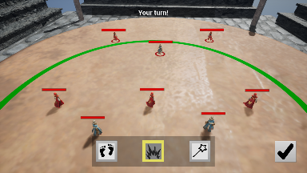
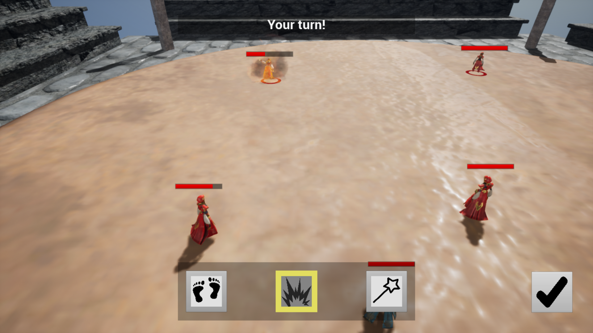

# Arena Squad Strategy

### Overview

<p float="left">


</p>

[Video Preview](https://drive.google.com/file/d/1knR5V4S7jIn-r3ljkLcgxQ3JZdWQdmzB/preview)

Arena Squad Strategy is a step-by-step battlefield strategy game. The main objective is to kill enemy troopers first combining your troopers abilities and movement. The game supports LAN-multiplayer mode.
### Installation

Download Windows x86-64 build in *Releases* tab.

### Getting source code

Clone the project using `git`:

```
git clone https://git.eyakm.one/eyakm1/awesome_game.git
```

Unfortunately this git-hosting does not support ssh yet.